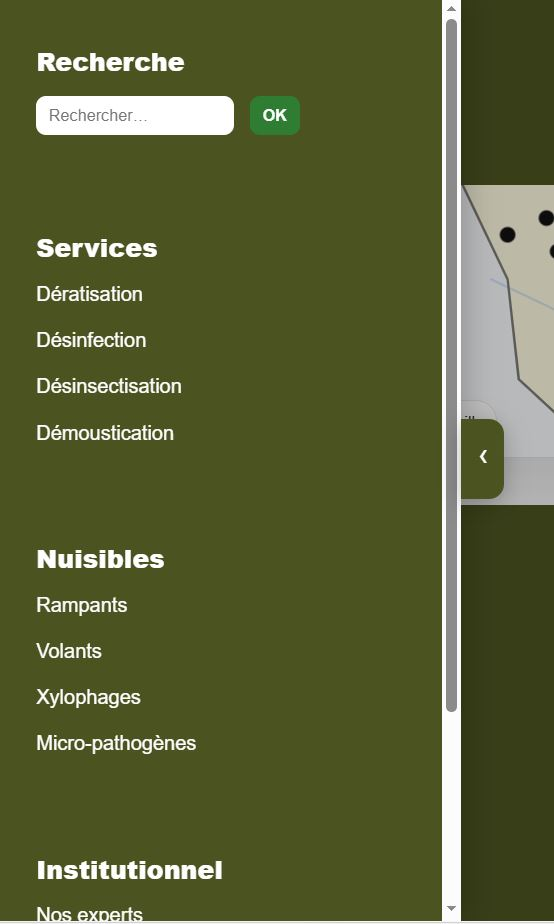

# WP VPCE Side Drawer

Plugin WordPress ajoutant une barre latérale interactive universelle pour améliorer la navigation et l’accès rapide aux contenus clés.

---

## 🎯 Problème

Les sites WordPress riches en contenus manquent souvent de raccourcis visibles vers les pages importantes (recherche, services, actualités, contact, newsletter).

Résultat :
- navigation moins fluide
- trop de clics pour accéder aux contenus clés
- perte d’attention utilisateur

---

## 💡 Solution

WP VPCE Side Drawer ajoute une barre latérale interactive accessible sur toutes les pages, intégrant recherche interne, liens rapides, overlay et formulaire newsletter.

---

## 🚀 Bénéfices

- Amélioration de la navigation globale
- Réduction du nombre de clics
- Accès rapide aux contenus stratégiques
- Augmentation potentielle de l’engagement (newsletter, pages clés)
- Expérience utilisateur optimisée (desktop & mobile)

---

## 🖼️ Aperçu

### 📂 Drawer fermé


### 📂 Drawer ouvert


### 📱 Version mobile


---

## ⚙️ Fonctionnement

Le plugin injecte automatiquement une barre latérale via les hooks WordPress (`wp_footer`) et gère les interactions utilisateur avec JavaScript (ouverture, fermeture, overlay, navigation).

---

## 🛠️ Stack

- PHP
- WordPress Hooks
- JavaScript
- CSS responsive

---

## 📦 Installation

1. Copier le dossier du plugin dans :

```bash
wp-content/plugins/wp-vpce-side-drawer/

Extensions > Activer


wp-vpce-side-drawer/
├── wp-vpce-side-drawer.php
├── README.md
└── assets/
    ├── css/
    │   └── side-drawer.css
    └── js/
        └── side-drawer.js

👤 Auteur

Sévérin OGAH